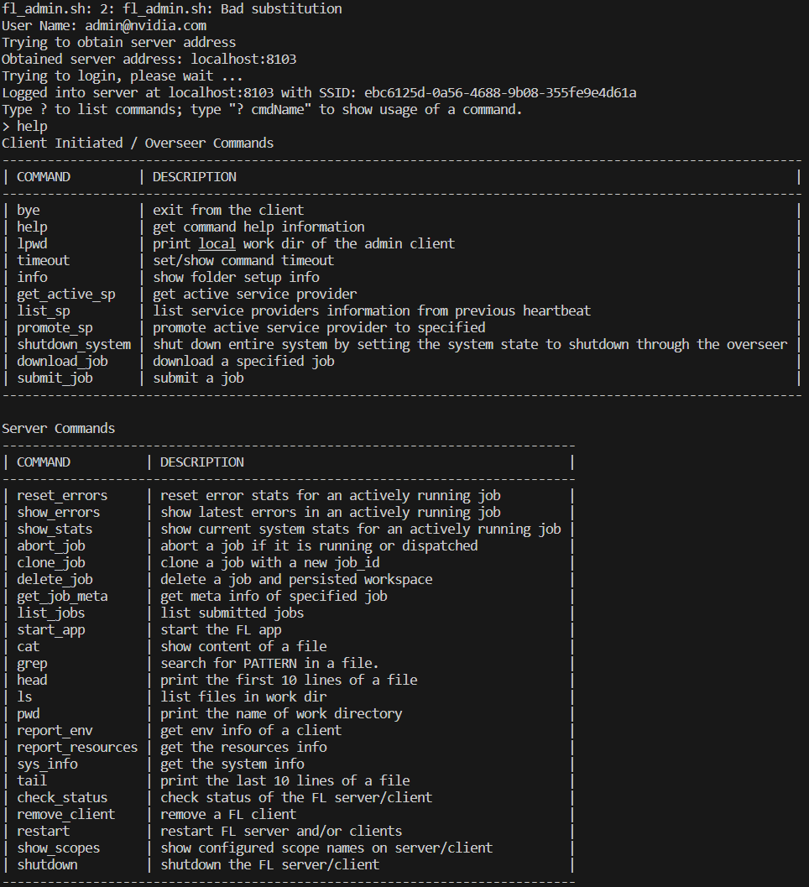

# 数据集CIFAR-10，利用NVFlare部署FL

[FedAvg](https://arxiv.org/abs/1602.05629) 运行指南，并在训练期间向server流式传输TensorBoard指标和[同态加密](https://developer.nvidia.com/blog/federated-learning-with-homomorphic-encryption/)。

使用配置和管理员API提交job，类似于在真实世界部署中设置实验的方式。

## 1. 安装要求

安装训练所需的软件包

```
pip install --upgrade pip
pip install -r ./requirements.txt
```

​	requirements.txt内容

```txt
# python 3.8~3.9
nvflare[HE]~=2.4.0rc
torch
torchvision
tensorboard
```

设置 `PYTHONPATH` 以包含此示例的自定义文件（pt）：

```bash
export PYTHONPATH=${PWD}/..
```

​	文件结构

```bash
path/to/cifar10/
├── cifar10-real-world
│   ├── figs
│   │   └── plot_tensorboard_events.py
│   ├── jobs
│   │   ├── cifar10_fedavg_he	# 单个job
│   │   │   ├── cifar10_fedavg_he
│   │   │   │   └── config
│   │   │   │       ├── config_fed_client.json
│   │   │   │       └── config_fed_server.json
│   │   │   └── meta.json
│   │   └── cifar10_fedavg_stream_tb	# 单个job
│   │       ├── cifar10_fedavg_stream_tb
│   │       │   └── config
│   │       │       ├── config_fed_client.json
│   │       │       └── config_fed_server.json
│   │       └── meta.json
│   ├── plot-requirements.txt
│   ├── prepare_data.sh
│   ├── README.md
│   ├── requirements.txt
│   ├── run_experiments.sh
│   ├── shutdown_fl_run.sh
│   ├── start_fl_secure.sh
│   ├── submit_job.py
│   ├── submit_job.sh
│   └── workspaces
│       ├── secure_project.yml
│       └── workspace
└── pt
    ├── learners
    │   ├── cifar10_learner.py
    │   ├── cifar10_model_learner.py
    │   ├── cifar10_scaffold_learner.py
    │   ├── cifar10_scaffold_model_learner.py
    │   ├── __init__.py
    │   └── __pycache__
    │       ├── cifar10_model_learner.cpython-38.pyc
    │       ├── cifar10_scaffold_model_learner.cpython-38.pyc
    │       └── __init__.cpython-38.pyc
    ├── networks
    │   ├── cifar10_nets.py
    │   └── __pycache__
    │       └── cifar10_nets.cpython-38.pyc
    └── utils
        ├── cifar10_dataset.py
        ├── cifar10_data_splitter.py
        ├── cifar10_data_utils.py
        └── __pycache__
            ├── cifar10_dataset.cpython-38.pyc
            ├── cifar10_data_splitter.cpython-38.pyc
            └── cifar10_data_utils.cpython-38.pyc
```

## 2. 下载CIFAR-10数据集

为了加速后续实验，首先下载[CIFAR-10](https://www.cs.toronto.edu/~kriz/cifar.html)数据集：

```
./prepare_data.sh
```

**注意:**这运行多任务实验或在同一台机器上运行多个client提前下载数据集很重要。避免每个job都会尝试将数据集下载到同一位置，这可能会导致文件损坏。

## 3. 创建FL workspace并启动FL系统

脚本将自动启动FL server和8个client在本地主机上运行FL实验。
在此示例中，我们在一个GPU上运行所有8个client，每个job至少需要8GB内存，也即一个gpu需要8G内存。

### 3.1 Secure FL workspace

项目文件./workspaces/secure_project.yml。（secure_project.yml的解析见文件附录）

**操作：**

使用以下命令构建secure workspace(项目名，也是项目保存路径，定义在secure_project.yml)

项目构建后，将启动项复制到`secure_workspace`以供后续实验使用。

```
cd ./workspaces
nvflare provision -p ./secure_project.yml
cp -r ./workspace/secure_project/prod_00 ./secure_workspace
cd ..
```

**结果：**

运行之前workspaces文件结构

```bash
path/to/cifar10/cifar10-real-world/workspaces
├── secure_project.yml
└── workspace
```

运行之后workspaces文件结构

```bash
/research/d1/ascstd/s1155216812/code/nvflare_demo/NVFlare/examples/advanced/cifar10/cifar10-real-world/workspaces
├── secure_project.yml
└── workspace
    └── secure_project
        ├── prod_00
        │   ├── admin@nvidia.com
        │   │   ├── local
        │   │   ├── startup
        │   │   │   ├── client.crt
        │   │   │   ├── client.key
        │   │   │   ├── client.pfx
        │   │   │   ├── fed_admin.json
        │   │   │   ├── fl_admin.sh
        │   │   │   ├── readme.txt
        │   │   │   └── rootCA.pem
        │   │   └── transfer
        │   ├── server1
        │   │   ├── local
        │   │   │   ├── authorization.json.default
        │   │   │   ├── log.config.default
        │   │   │   ├── privacy.json.sample
        │   │   │   └── resources.json.default
        │   │   ├── readme.txt
        │   │   ├── startup
        │   │   │   ├── fed_server.json
        │   │   │   ├── rootCA.pem
        │   │   │   ├── server_context.tenseal
        │   │   │   ├── server.crt
        │   │   │   ├── server.key
        │   │   │   ├── server.pfx
        │   │   │   ├── signature.json
        │   │   │   ├── start.sh
        │   │   │   ├── stop_fl.sh
        │   │   │   └── sub_start.sh
        │   │   └── transfer
        │   ├── ...
        ├── resources
        │   └── master_template.yml
        └── state
            └── cert.json
```

### 3.2 多任务资源管理

**GPU资源需求说明**

查询可用GPU数量`N_GPU`

```
export N_GPU=$(nvidia-smi --list-gpus | wc -l)
echo "There are ${N_GPU} GPUs available."
```

一个job包括8个client，每个client需要大约1GB的GPU内存来运行CIFAR-10数据集的FL实验，同一个job并行运行8个需要8GB内存。FL系统将安排最多 `N_GPU` 的job并行运行。

**更改GPU请求设置**

更改job的GPU内存请求，更改job的`meta.json`文件中设置`"mem_per_gpu_in_GiB"`值。

更改client的可用资源，将`resource.json.default`复制到`resources.json`并按如下方式修改：

```bash
sh allocate_gpu.sh
```

```bash
# allocate_gpu.sh内容
n_clients=8
for id in $(seq 1 $n_clients)
do
  client_local_dir=workspaces/secure_workspace/site-${id}/local
  cp ${client_local_dir}/resources.json.default ${client_local_dir}/resources.json
  # 确保 N_GPU 这个变量已经被定义和设置过
  sed -i "s|\"num_of_gpus\": 0|\"num_of_gpus\": ${N_GPU}|g" ${client_local_dir}/resources.json
  sed -i "s|\"mem_per_gpu_in_GiB\": 0|\"mem_per_gpu_in_GiB\": 1|g" ${client_local_dir}/resources.json
done
```

### 3.3 启动 FL 系统

**本地启动Server和8个Client**

```bash
cd workspaces
```

通过脚本直接在secure workspace中启动带有 8 个client的 FL 系统

```bash
./start_fl_secure.sh 8
```

```bash
# start_fl_secure.sh内容
...
# 从命令行参数获取客户端数量
n_clients=$1

# 启动服务器
echo "STARTING SERVER"
export CUDA_VISIBLE_DEVICES=0
"${workspace}/${servername}/startup/start.sh" &
sleep 10

# 启动所有客户端
echo "STARTING ${n_clients} CLIENTS"
for id in $(eval echo "{1..$n_clients}")
do
  "${workspace}/${site_pre}${id}/startup/start.sh" &
done
sleep 10
```

通过命令挨个启动

```bash
# server
nohup secure_workspace/localhost/startup/start.sh >> ../log/server.log 2>&1 &

nohup secure_workspace/site-1/startup/start.sh >> ../log/site-1.log 2>&1 &
nohup secure_workspace/site-2/startup/start.sh >> ../log/site-2.log 2>&1 &
nohup secure_workspace/site-3/startup/start.sh >> ../log/site-3.log 2>&1 &
nohup secure_workspace/site-4/startup/start.sh >> ../log/site-4.log 2>&1 &
nohup secure_workspace/site-5/startup/start.sh >> ../log/site-5.log 2>&1 &
nohup secure_workspace/site-6/startup/start.sh >> ../log/site-6.log 2>&1 &
nohup secure_workspace/site-7/startup/start.sh >> ../log/site-7.log 2>&1 &
nohup secure_workspace/site-8/startup/start.sh >> ../log/site-8.log 2>&1 &
```


**分布式启动**

在保证server端的域名能client端访问的情况下，将生成的startup kits分发给不同节点。每个节点单独运行start.sh。

下面以本地单机启动为例。

## 4. 运行job

通过`submit_job.sh`提交job以自动开始 FL 训练。server将分割 CIFAR-10 数据集以模拟每个client具有不同的数据分布。

```
./submit_job.sh [job] [alpha]
```

- `job` 参数控制要提交的实验job。
  - 将通过 submit_job.py 使用 admin API 提交 `jobs` 文件夹下的相应文件夹以进行调度。admin API 脚本 (submit_job.py) 还会根据提供的命令行参数覆盖job配置文件中的 alpha 值。
  - job将根据每个client可用的资源自动执行。
-  `alpha` 控制异质性

示例

```bash
# 使用同态加密进行安全聚合
./submit_job.sh cifar10_fedavg_he 1.0
```


## 5. 登录admin账户

登录方式

1. 运行命令

```bash
cd  path/to/cifar10-real-world/workspaces/secure_workspace/admin@nvidia.com/startup
sh fl_admin.sh
```

有

```bash
fl_admin.sh: 2: fl_admin.sh: Bad substitution
User Name: 
```

2. 输入用户名：admin@nvidia.com
3. 输入help查询可用命令




# 报错解决方案

1. Server端端口被占用，如何解决

```
# 展示占用进程
lsof -i :8102
lsof -i :8103
# 终止进程
kill -9 PID
```

或者直接运行` bash cifar10-real-world/clear_port.sh`

此外，

查询网络端口是否可以连接

```bash
telnet localhost 8103
```


# 附录

## 节点之间访问的逻辑

server端（以及overseer端）通过域名设置被访问的ip地址，同事在project.yml文件中定义端口。

client端不需要设置域名和端口，因为只要client访问server即可。

server端需要保证域名和端口是可被访问的


## 配置文件解读

```yaml
api_version: 3  # API版本号
name: secure_project  # 项目名称
description: NVIDIA FLARE sample project yaml file for CIFAR-10 example  # 项目描述

participants:
  - name: overseer.example.com
    type: overseer  # 角色类型：监管者
    org: nvidia  # 组织
    protocol: https  # 使用的协议
    api_root: /api/v1  # API根路径
    port: 8443  # 端口号
  - name: localhost
    type: server  # 角色类型：server
    org: nvidia  # 组织
    fed_learn_port: 8102  # 联邦学习服务端口
    admin_port: 8103  # 管理服务端口
  - name: site-1
    type: client  # 角色类型：client
    org: nvidia  # 组织
  - name: site-2
    type: client
    org: nvidia
	...
  - name: admin@nvidia.com
    type: admin  # 角色类型：管理员
    org: nvidia  # 组织
    role: project_admin  # 角色名称：项目管理员

# 构建器部分：按定义顺序调用所有构建器的方法
builders:
  - path: nvflare.lighter.impl.workspace.WorkspaceBuilder
    args:
      template_file: master_template.yml  # 使用的模板文件
  - path: nvflare.lighter.impl.template.TemplateBuilder
  - path: nvflare.lighter.impl.static_file.StaticFileBuilder
    args:
      config_folder: config  # 配置文件夹，包含了各种静态配置文件，用于不同的服务或节点。
      overseer_agent:
        path: nvflare.ha.dummy_overseer_agent.DummyOverseerAgent # 指向一个虚构的监管者代理
        # 如果已经存在监管者，则忽略下面的参数
        overseer_exists: false  # 是否存在监管者，这里设置为 false，意味着需要创建一个监管者。
        args:
           sp_end_point: localhost:8102:8103  # 定义了监管者的端点地址 localhost:8102:8103
           heartbeat_interval: 6  # 心跳间隔（秒）
  - path: nvflare.lighter.impl.he.HEBuilder
    args:
      poly_modulus_degree: 8192  # 多项式模数度，是同态加密参数的一部分。
      coeff_mod_bit_sizes: [60, 40, 40]  # 系数模位大小设置为 [60, 40, 40]，这也是同态加密中的关键参数。
      scale_bits: 40  # 缩放位大小
      scheme: CKKS  # 使用的加密方案为 CKKS，这是一种用于同态加密的流行方案。
  - path: nvflare.lighter.impl.cert.CertBuilder  # 证书生成器，这些证书是联邦学习环境中实现安全通信的关键组成部分。
  - path: nvflare.lighter.impl.signature.SignatureBuilder  # 签名生成器，用于生成数字签名，这有助于验证数据的完整性和来源，保证联邦学习中数据的安全性和信任。
```


### 头部信息

- **api_version**: 指定 API 的版本。这里是 `3`。
- **name**: 项目的名称，这里是 `secure_project`。
- **description**: 对项目的简短描述，表明这是一个用于 CIFAR-10 示例的 NVIDIA FLARE 样本项目。

### 参与者配置

- participants: 列出了所有参与联邦学习项目的各方。包括监管者、server、client和管理员。
  - **overseer.example.com**: 监管者节点。**overseer.example.com**: 是识别名，也是监管者节点的域名。使用 HTTPS 协议表明这是一个安全的连接，端口为 8443。
  - **localhost**: 作为server节点，这里设置了两个端口，有独立的联邦学习端口 (`8102`) 和管理端口 (`8103`)。
    - **8102**: 联邦学习端口，client通过这个端口向server发送或接收与学习任务相关的数据。
    - **8103**: 管理端口，用于进行server的管理操作，如配置更新、监控server状态等。
  - **site-1 至 site-8**: 八个client节点，都属于 nvidia 组织。
  - **[admin@nvidia.com](mailto:admin@nvidia.com)**: 项目管理员，具有 `project_admin` 角色。
- 关于name的含义。在 NVFlare 配置中，`name` 字段通常用作区分不同节点的识别名。这些识别名可以是域名（如 `overseer.example.com`），也可以是本地或内部网络的主机名（如 `localhost`），或者是为了配置方便而使用的简称（如 `site-1` 和 `site-2`）。

### 构建器配置

- builders: 定义了一系列构建器，它们按定义的顺序调用。
  - **WorkspaceBuilder**: 使用模板文件 `master_template.yml` 来构建工作空间。
  - **TemplateBuilder**: 负责处理模板文件。
  - **StaticFileBuilder**: 处理静态文件，配置文件夹为 `config`。如果没有现成的监管者，可以通过此构建器的参数创建一个虚拟监管者。
  - **HEBuilder**: 配置同态加密的参数，使用 CKKS 方案。
  - **CertBuilder**: 负责生成和管理证书。
  - **SignatureBuilder**: 负责处理签名相关的构建。

### 特别说明

- 在 `StaticFileBuilder` 中，`overseer_exists` 参数控制是否需要创建一个监管者。如果设置为 `true`，则此部分的参数被忽略，系统会自动填充必要的本地参数。如果为 `false`，则会根据此部分的参数配置一个监管者。

